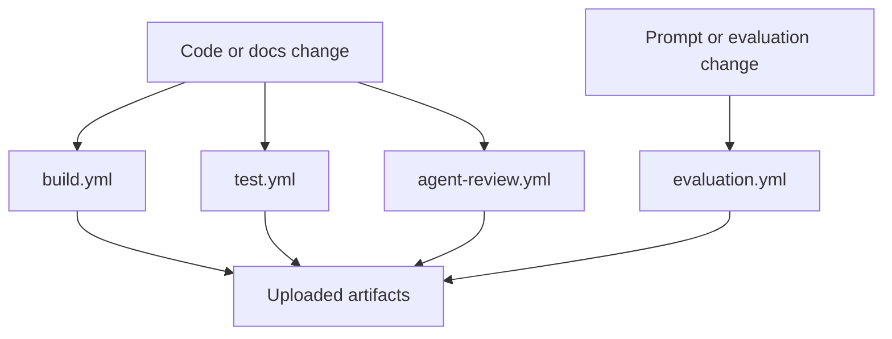

# gh600-agentic-lab

This repository is an educational lab for **GitHub Certified: Agentic AI Developer (GH-600)**. The goal is not to build a production application; the goal is to show where common agentic AI and GitHub artifacts live, what they look like, and why they matter.

## Why this repository exists
- To provide a tiny Python application that agents can read, modify, test, and review.
- To demonstrate common repository artifacts such as workflows, prompts, guardrails, memory notes, and evaluation files.
- To keep every example heavily explained so learners understand both the artifact format and its real-project purpose.

## Tiny application
- `app/main.py` contains the hello-world application and prints `Hello GH-600`.
- `tests/test_main.py` contains the unit tests that validate the tiny application.

## Folder map and GH-600 domain alignment
| Path | Purpose | GH-600 concept demonstrated |
| --- | --- | --- |
| `app/` | Minimal Python application code | Small code target for agent tasks |
| `tests/` | Unit tests for the sample app | Automated validation for agent changes |
| `.github/workflows/` | Four educational GitHub Actions workflows | CI, evaluation, artifact upload, review automation |
| `.github/instructions/` | Role-specific instruction files | Agent boundaries, goals, escalation rules |
| `.github/ISSUE_TEMPLATE/` | Structured issue intake forms | GitHub management and triage artifacts |
| `agents/` | Custom agent examples | Agent purpose, tools, memory, constraints |
| `prompts/` | Reusable prompt templates | Prompt engineering and repeatable context |
| `mcp/` | Model Context Protocol examples | MCP server configuration and safe placeholders |
| `guardrails/` | Coding, security, and compliance policies | Allowed, denied, and approval-required actions |
| `memory/` | Short-term and long-term memory explanations | Agent memory lifecycles and examples |
| `evaluation/` | Rubric, success criteria, and benchmark JSON | Evaluation design and scoring artifacts |
| `human-review/` | Human approval and escalation documentation | Human-in-the-loop governance |
| `orchestration/` | Multi-agent workflow examples | Planner → Developer → Test → Reviewer → Human flow |
| `observability/` | Logs, audit, and metrics examples | Monitoring, auditing, and traceability |

## Where key GH-600 artifacts live
- **Agents live in:** `agents/`
- **Prompts live in:** `prompts/`
- **Guardrails live in:** `guardrails/`
- **Evaluations live in:** `evaluation/`
- **Human review guidance lives in:** `human-review/`
- **MCP examples live in:** `mcp/`
- **Repository instruction files live in:** `.github/instructions/`

## GitHub management artifacts
- Issue templates: `.github/ISSUE_TEMPLATE/`
- Pull request template: `.github/pull_request_template.md`
- Ownership routing: `CODEOWNERS`
- Security policy: `SECURITY.md`
- Contribution guide: `CONTRIBUTING.md`

## GitHub Actions flow diagram


## How to run the sample locally
```bash
python app/main.py
python -m unittest discover -s tests -v
```

## How this would differ in a real project
A production repository would likely include richer application code, stronger test coverage, secret management, deployment pipelines, real CODEOWNERS teams, approval automation, and integrations with live MCP servers or review services. This repository intentionally stays small so each GH-600 artifact is easy to locate and inspect.
