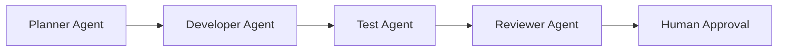

# Multi-Agent Workflow Diagram

## Why this file exists
This file shows where an orchestration artifact might live in a GH-600-style repository. It demonstrates that multi-agent systems should expose their control flow for human review.

## Example diagram

## Real-project usage
A real orchestration diagram might include retry loops, memory stores, tool gateways, and approval checkpoints.
